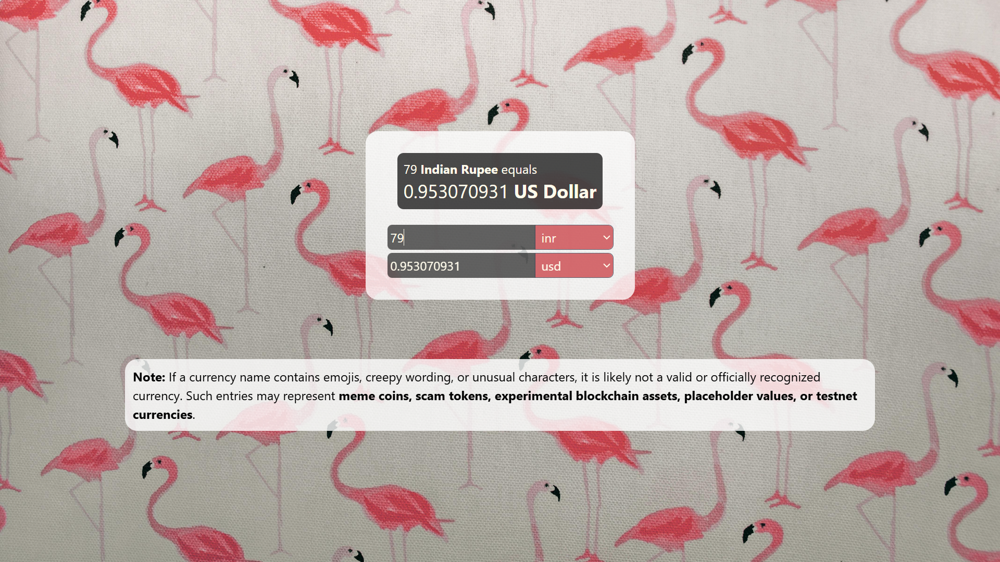
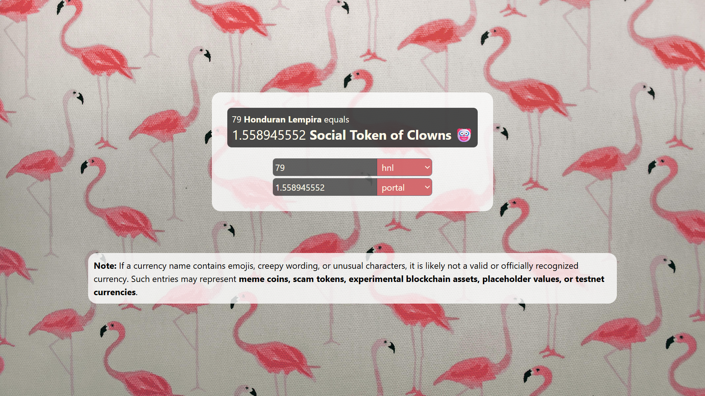
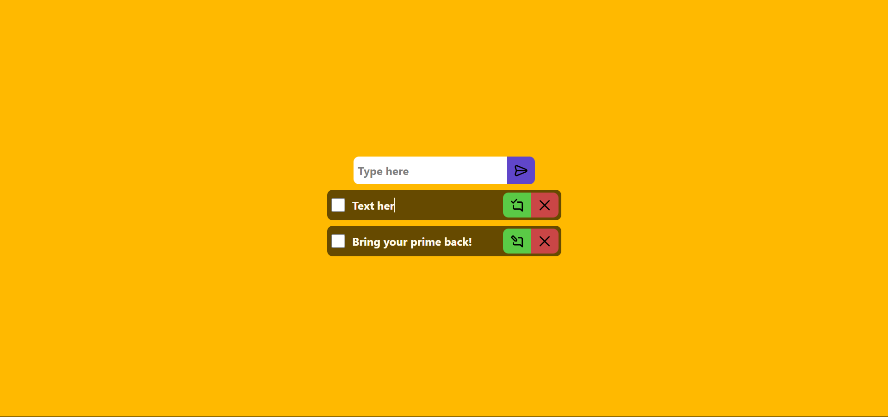

# 🧩 Mini React Projects
A collection of clean, responsive **React.js mini projects** built for showcasing frontend skills.

## 🚀 Projects Included
Each project is built using modern React practices.
| Project         | Preview                        |
|----------------|------------------------------------|
|Currency Converter |  |
|                       |                                            |
|                     |  |
|Password Generator |  |
|                       |                                            |
|Todo |  |

## 🧠 Tech Stack
- ⚛️ **React JS** (Functional Components + Hooks)
- 🎨 **Tailwind CSS** for styling
- 📦 **Vite** for fast development builds
- 🔗 APIs used: [Fawaz Currency API](https://github.com/fawazahmed0/currency-api)
